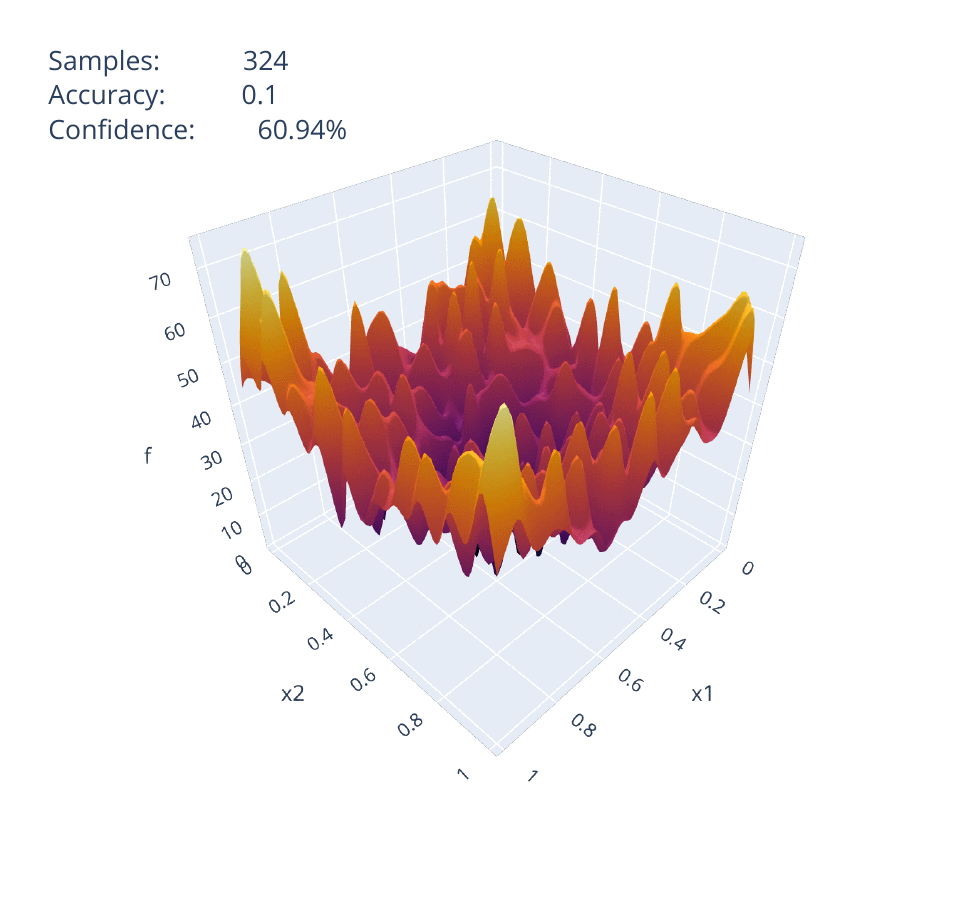

.. guidepy documentation master file, created by
    sphinx-quickstart on Thu Nov 28 11:06:55 2019.
    You can adapt this file completely to your liking, but it should at least
    contain the root `toctree` directive.

**mmgpy** module
================

Metamodel Guidance with Python, or **mmgpy**, is a library to provide metamodelling (or surrogate modelling)
capabilities of expensive black-box functions for the purpose of guidance optimisation, through the use of machine
learning. It has been developed during my internship at Airbus Defence and Space in Toulouse under the supervision of
Kristen Lagadec.

Explore the target function
###########################

.. code-block:: python3

    from mmgpy.benchmark import Rastrigin
    from mmgpy.sampling import uniform_grid
    from mmgpy.plotting import plot_3d_surface

    # Define a callable target function.
    rastrigin2D = Rastrigin(2)

    # Sample the domain with uniform grid sampling.
    x1, x2 = uniform_grid(2, 100, flatten=False)

    # Plot the 3D surface response.
    plot_3d_surface(x1, x2, rastrigin2D(x1, x2))

.. raw:: html
    :file: _static/example1.html

Meta-model the target function
##############################

.. code-block:: python3

    from mmgpy.algorithm import EasySSIFL
    from mmgpy.plotting import make_ssifl_gif

    # Define a callable target function.
    rastrigin2D = Rastrigin(2)

    # Choose learning algorithm.
    ssifl = EasySSIFL(rastrigin2D)

    # Iterate to desired accuracy and confidence.
    results = ssifl.iterate_to(accuracy=0.1, confidence=0.95)

    # Make gif of learning.
    make_ssifl_gif(results)

Optimise the meta-model
#######################

Analyse the surrogate optimum
#############################

.. toctree::
   :maxdepth: 2
   :caption: Sub-modules
   :hidden:

   _src_docs/sampling
   _src_docs/dataset
   _src_docs/matlab_
   _src_docs/metamodel
   _src_docs/algorithm
   _src_docs/optimise
   _src_docs/problems
   _src_docs/plotting
   _src_docs/benchmark

.. toctree::
   :maxdepth: 2
   :caption: Notebooks

   _src_notebooks/HOPT - Sampling Importance
   _src_notebooks/SSIFL training

Indices and tables
==================

* :ref:`genindex`
* :ref:`modindex`
* :ref:`search`

